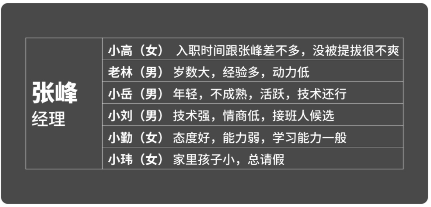

# 人才盘点:如何快速的了解团队成员

新经理最首要的任务就是要为自己的人做一个“人才盘点”。然后,针对不同人才,匹配相应的发展策略,把团队调节到最佳状态。

成为一个带人经理听起来很威风,但相比起你之前带过的项目和产品,“人”可就没那么好带了！

美国的一位领导力大师叫做马歇尔·戈德史密斯,也是全世界最贵的领导力教练,他有一本非常著名的书叫做"What got you here, won' t get you there”, 意思是把你带到今天这个位置的能力,并不能把你带到明天。

我觉得每一位刚刚提拔上来的经理，都应该把这句话写下来, 贴在墙上， 天天提醒自己。不管你之前做事的时候有多牛，现在带人所需要的技能完全是两码事，需要重新学习。而职位的升级并不能自动带来认知升级，领导力发展的本质其实就是心智模式的转换和升级，因为心智模式决定思维方式和行为方式。不了解这一点，你会死得很惨！不信咱们来看看今天的案例，还是接着试听课中那个刚被提拔的新经理张峰。

上任不久，张峰主动和老板约了一次会，希望了解老板对自己的期望。在会上，老板肯定了张峰过硬的技术能力以及和团队同事间的融洽关系，并特别提到他勇于突破传统的个性也是这次他获得晋升的原因之一。

对于这次新成立的XYZ项目团队，老板也透露到这是公司尝试向新战略转型的一个试点，所以非常希望张峰带领团队能用一年左右时间，探索出新业务模式，并提升技术部门对公司业务的影响力，而不总是被业务部门看作是一帮搞技术的码农。

面对老板的信任和期望，又想想团队人员的现状，张峰心里忐忑不安，五味俱全，一方面是对新角色的兴奋和公司未来方向的憧憬，另一方面对自己是否胜任之一角色有些担心，对如何激励团队的人员感到有些困惑和无力.....，那么如果你是张峰此时要怎么办呢?

首先，我们看下张峰的团队都有什么人? 能看出来张峰团队的员工有着不同的绩效水平，个性特质也各有不同，如果对人才发展阶段和发展需求没有一个准确的分析，面对晋升失败心里不服的小高; 缺乏动力的老林，情商低的技术男小刘，能量充沛的小岳，和表现欠佳的小勤和小玮，张峰仅仅依靠个人的本能反应，使用千人一面的管理方式，一定不能很好的挖掘和释放团队成员的潜能。那怎么办呢?

## 案例分析

刚才我们提到在新经理角色转换期需要完成一个重要的心智模式转——那就是要从琢磨事儿转换成琢磨人。

因为你需要靠手下的这些人来帮你实现业务目标，所以新经理最首要的任务就是要为自己的人做一个“人才盘点”，然后，针对不同人才，匹配相应的发展策略。

所以一个好的经理更像是个老中医，需要先号号脉，再按需抓药，最后再把团队调节到最佳状态。通过“人才盘点”，会帮助新经理在管理团队的过程中实现以下三大目标：

1.通过明确业务发展所需要的人才标准，把业务目标和人员能力标准挂钩，在业务发展与人员培养之间建立联系

2.绘制部门或团队的人才地图;

3.为优化团队的人才梯队做准备。

那么人才盘点具体怎么操作呢?

## 明确业务发展所需要的人才标准

一个好的公司应该有一套成熟，透明的流程让每个人都清楚的知道在选拔，培养，用人上的标准，什么岗位需要什么样的人才标准?为什么是这样的?

在成熟的大型组织中常使用岗位胜任力模型，任职资格，成功剖象/人才画像等不同方法来定义人才标准。对于新经理而言，如果你所在企业有这类成熟的、经过验证的管理工具和系统，那敢情好;如果没有，你就得自己多做点功课了。

在考虑团队人才标准时，特别需要关注几类问题

1.公司的发展战略和重要业务目标是什么?

2.部门/团队的被考核的业绩目标是什么?

3.部门业绩目标和公司战略落地及业绩目标达成之间的关系是什么?

4.要完成业务目标，团队需要完成什么任务，以及完成任务所需要的能力有哪些?

这些问题都是帮助你从宏观的角度，用全局的视角理解公的业务，理解部门/团队在公司业务中的价值，以及任务与人员能力之间的关系。