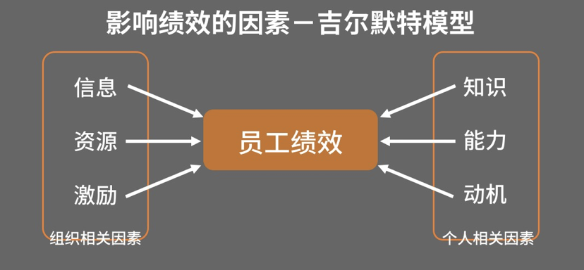

#目标设定：给团队设定合理的绩效

**作为领导，我们要从为自己设定目标达成目标，变成为团队设定目标，围绕目标进行辅导和激励，带领团队完成目标。**

刚当上领导的时候，是不是觉得还挺开心，终于手下有人了，可以按照自己想法，安排他们去干活了。但把工作安排下去之后，才发现完全不是那么回事啊！下属不是做的不合心意，就是努力半天也没达到预想的结果。所以新经理们，要么就气不打一处来，责怪这届下属不行，要么就索性撸起袖子自己干。

所以新经理面临的挑战之一就是：**建立全局观思维，从“救火队员”到“团队业务的规划者”**。

 

在哈佛大学一个有关新经理角色转换期的研究中，教授们发现一个令人惊讶的现实：大部分新经理要到上任的第一年年底才真正开始关注如何将老板的目标（公司的战略目标） 融入到团队的业务发展目标中。1年？如果你在一家大公司，比较宽松，容得了人慢慢成长也就算了，如果你在一家创业型公司，很可能还没等到你庆祝当经理的第一个周年就已经被干掉了！

**如果没有从全局的视角确定团队业务目标和策略，又怎能清晰的定义团队的人才目标呢！**

就像我们在新经理的角色认知转化中说的，我们需要从“自己干”，变成“带着别人干”。作为领导，我们要从为自己设定目标达成目标，变成一是为团队设定目标，二围绕目标进行辅导和激励，带领团队完成目标。

你可能会说，我告诉他们要做什么了呀！为什么工作安排出去，却总不如我所愿呢？

因为在具体做事的过程中会有方方面面的因素影响员工的绩效。包括他是不是获得了足够的信息、资源，他是不是有相应的知识和能力，以及他是否有足够的动力，并受到及时激励。

有多种的因素共同作用影响着员工的绩效，也就影响着团队最终的工作结果。 大家可以重点看下影响绩效因素的吉尔默特模型。

那么对于团队负责人的你，你能怎么尽可能的提升员工的绩效呢？

首先，从给员工设定一个合适的目标开始。这也是今天的课程内容。好的目标，是成功的一半。你会发现很多问题，压根从一开始的目标设定上就出了问题。

当设定完目标之后，我们还需要根据每一块目标和员工的能力，进行授权。所以下节课，我们就来讲讲授权。对于能力有待提升的员工来讲，我们既要指导他们的工作，但又不能越俎代庖，让他们失去成长空间。

有了合适的目标，有了相应的知识能力，以及激励，员工就能顺利的完成工作了吗？不完全。

因为事情是不断变化的，作为经理人就需要在工作过程中不断跟进员工的状态，进行辅导，并向他们反馈。

**今天我们先从第一步，设定目标开始。**

给员工设定一个目标是很重要的，有一个明确的目标才能明确要达成的结果，才能指引前进的方向。并相对客观公正的评价员工。另外，好的目标设定还能调动了员工的主观能动性，激发潜能，将员工目标和团队目标紧密结合在一起。

让我们来看看张峰是怎么做的。

**明确的目标可以明确要达成的结果，指引前进的方向，并相对客观公正的评价员工。好的目标设定能调动员工的主观能动性，激发潜能，将员工目标和团队目标紧密结在一起。**

## 案例

> 张峰的老板要求他在半年之内把xyz项目上线，不仅要快速完成，质量还得过关。这个目标还挺有挑战性的，张峰心里又激动又忐忑。手里握着上次梳理的人才盘点图，他开始盘算，现在都有哪些工作，要怎么分配给下属们。
>
> 
>
> 首先是小刘，他技术强，对于项目又熟悉，张峰准备让他负责最难的A模块，同时还安排他去给大家做做项目培训。
>
> 
>
> 张峰叫来小刘，跟他说“小刘啊，咱这个项目很重要啊，上司特别重视。你的技术最好，咱们最难的A模块就交给你了哦！一定要高质量的完成！另外，咱们项目组里有好几个新同事，你准备个培训吧，让大家能更好的理解项目和技术细节”小刘欣然接受了任务。
>
> 
>
> 但过了两个星期，张峰却发现A模块的开发进度倒是挺快，但测试时出的问题也超出了正常值。另外，他期望在1周内完成的技术培训也一直都迟迟没开展。
>
> 交给他的事都做的不太漂亮，张峰有点生气，这个小刘怎么这么不靠谱！
>
> 张峰又找来了小刘，问他怎么回事。
>
> 
>
> 小刘也觉得挺委屈，说：“您不是说xyz这个项目时间紧，让我快点完成么？所以我就急着赶开发进度了。培训的事情我也在认真准备了，本来预计下周进行，不知道您要的这么急。”
>
> 听了小刘的反馈，张峰仔细琢磨了一下，好像也不能说是人家不靠谱，确实自己讲任务目标的时候没太说清楚。张峰有点疑惑，到底怎么跟员工设定目标才能合情合理，并且让他和你的理解达成一致呢？

##  设定目标模型——SMART

关于目标设定，在管理学里有一个非常重要的原则——SMART原则。

相信大部分的人对这个Smart原则并不陌生，但真正在实际工作中能把他用好了，可并不容易。

**S：代表Specific**，指目标必须是具体的，要明确的说明要达成的标准。很多时候没能成功实现目标的原因就是目标描述模棱两可。

比如张峰对小刘说，把A模块交给你了。这就是一个很模糊的目标。而应该说3个月内，A模块的开发进度要完成百分之百，这就是一个明确的目标。

**M：代表Measureable**，指的是目标是可衡量，且可根据衡量标准追踪的。如果目标不能衡量，你怎么知道究竟做到了没，在过程中又怎么知道已经完成了多少，还需要做什么呢？

比如，张峰跟小刘说，你的模块要保证高质的完成。这就很难衡量。究竟怎么样才算高质量完成呢？如果目标是说在测试中你的bug不能超过10个。这就是一个明确可衡量的目标。

**A：代表Attainable**，可达成的。当我们设定目标的时候，定的太低没有办法激发员工的动力，但定的太高不切合实际也会让人望而生畏，失去信心和动力。

比如我有一个销售的朋友，前段时间苦笑不得的跟我说，他在一家创业公司，最近老板要求他们要快速做大收入。之前每个月的业绩能达到5万就已经算是很不错了。但这个月老板说兄弟们，咱们要快速发展啊，直接给压了一个20万的目标！当时所有人听到就傻了，大家只有两种反应，要么就是觉得没戏了准备换工作吧，要么就觉得死猪不怕开水烫，反正这个业绩也是不可能达成的，索性混着好了。

确实如此，当制定的目标太高或者太低都不好，那怎样才算是一个合适的目标呢？就是制定一个他跳起来能够摸得到的目标。

如果不跳起来就能轻松够得着，没法激发他的成长和潜力。如果他用尽全力跳起来也够不着，那就会要么倍感挫败，要么索性放弃。

**R：代表Relevant**，指实现这个目标与其他目标要有相关性。比如张峰希望小刘以后能提升沟通能力，做团队的技术培训，那么在他的能力发展目标中可以设定让他去学习如何演讲，如何培训。但如果给他设定目标让他去学习销售管理相关知识，那就是与他现有工作和职能不相关的目标。

而比如小岳在开发的模块是跟销售工作直接相关的，他在开发过程中如果能懂得一些销售管理流程方面的知识，对于开发模块是有益处的，那么这就可以成为他的目标之一。

**T：Time-based**，要有时限性。在给下属制定目标或安排工作时，要明确表明时间限制。比如这个文件我下午6点之前要，或者说Q2结束业绩要增长100%。这样能够让两个人对于时间和紧急程度的认知程度达成一致。

### 案例分析

所以，回想下刚才的案例，如果用SMART原则给小刘设定目标的话，就可以是：在3个月内，A模块的开发进度要完成百分之百，且经测试其中的bug不超过10个。8月31日之前要完成跟其它三个模块的集成适配，且在整体测试中与A模块有关的bug不超过5个。

同时，小刘需要在下周五下午4点之前，给团队做一次技术培训，满意度要达到90%。

有了清晰的目标，不仅员工明确自己的方向，安排自己的行动计划，领导也可以更好的跟踪他的进展。

当然，要注意，目标也不能只是自己一拍脑袋就定了。我们需要跟员工进行沟通，最终共同设定目标，达成共识。这样才能是一个双方认可的，一致的目标。

## 总结

今天我们讲了如果设定目标，用SMART的方式来跟员工沟通和共识工作目标，明晰你对他的绩效预期。

当然，很多时候我们在工作中职责划分没那么清晰，难以量化，尤其是在小公司，大家的工作多多少少有交叉，那么就要灵活处理，不见非得用固定的模板来讲。有时候过于追求固定目标，会导致目标僵化，团队失去活力。

所以怎么制定目标，怎么制定绩效考核，不是一成不变的，需要领导者有审时度势的能力，关注外部市场情况变化，关注内部人员动态。在快速发展的企业中，发现变化，适应变化，真正读懂“人”，才能成为一个好的领导者。

今天的小任务是“如果你已经是带人经理，把你近期准备给下属安排的工作，运用SMART原则写下来。

假如你还没有成为带人经理，把自己近期的工作安排，用SMART原则写下来。”

